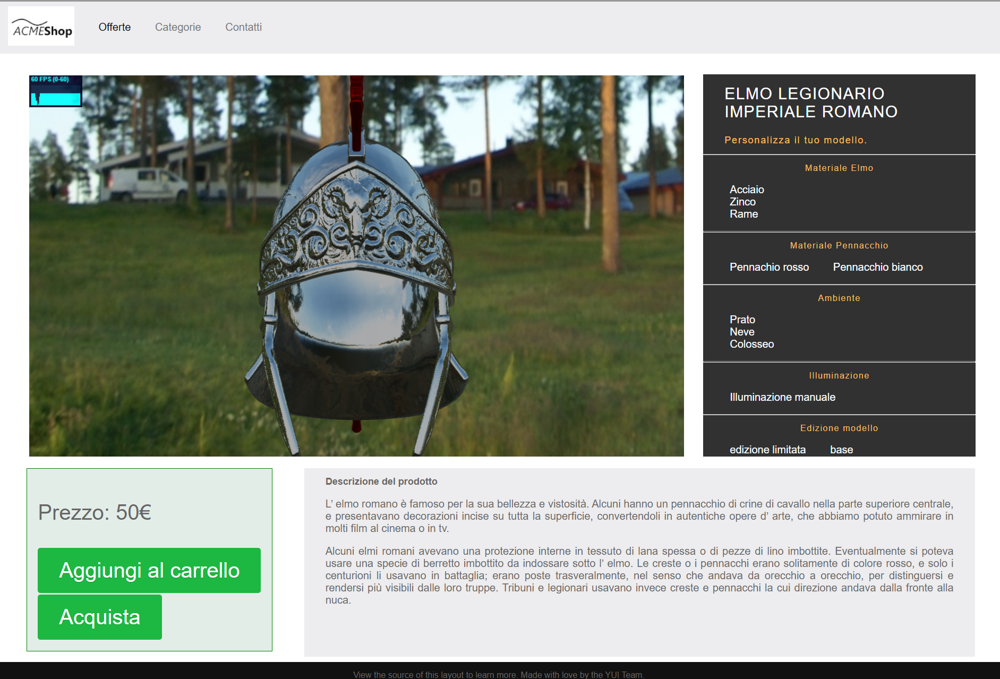
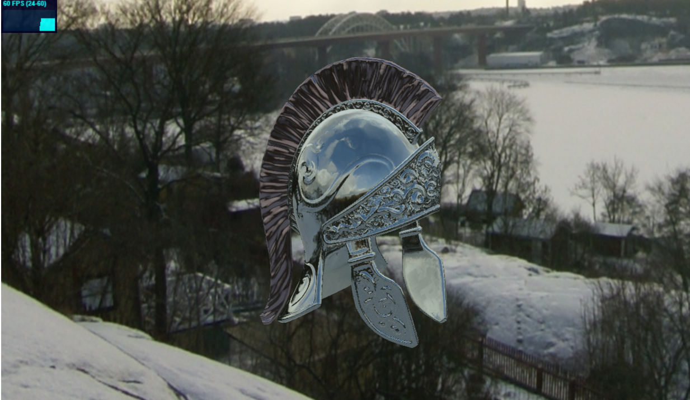
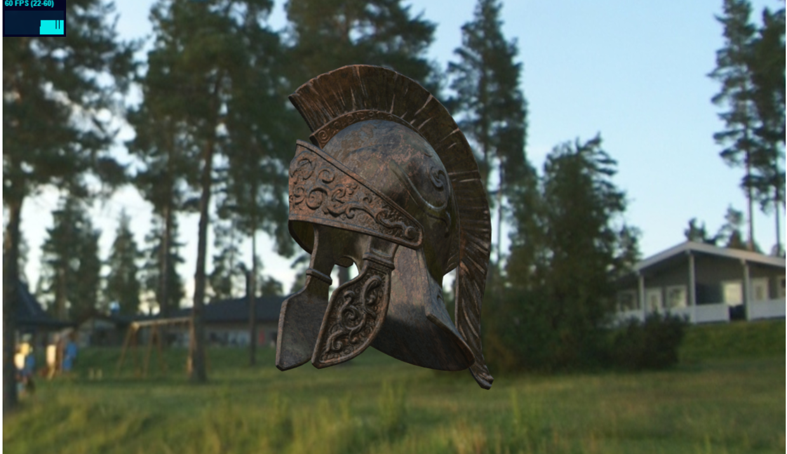
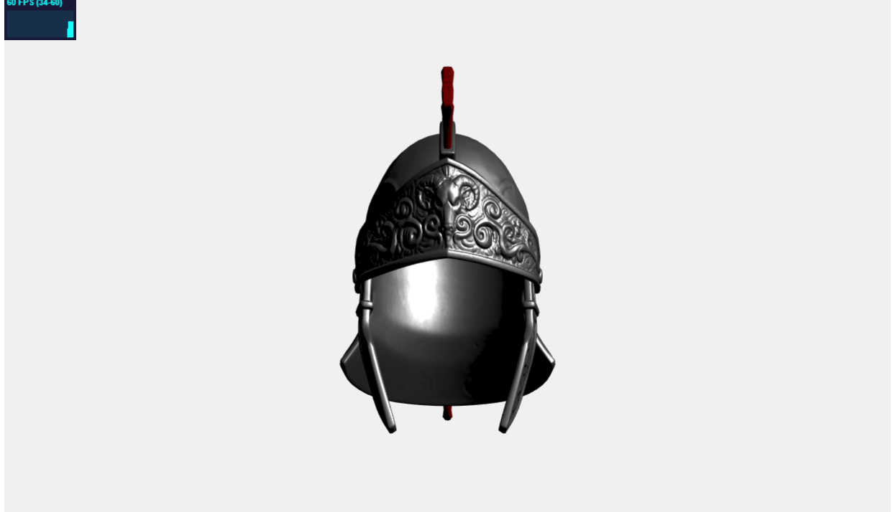

# Interactive 3D Graphics - Secondo progetto

## Autore
Massimiliano Gaio, 132588.

## Descrizione generale
Il seguente progetto presenta una pagina web simil e-commerce che permette all'utente di configurare le caratteristiche di un prodotto in vendita.

In questo caso il prodotto scelto è una riproduzione di un elmo romano, che l'utente può configurare manualmente nei materiali e nell'illuminazione. L'elmo supporta tre materiali: acciaio, zinco e rame; il pennacchio supporta due materiali: metallo bianco e rosso. Tale oggetto può essere inserito in tre diversi ambienti: un prato, una distesa innevata e all'interno del colosseo.

Le opzioni appena descritte fanno riferimento alla versione base del modello. In alternativa, infatti, è possibile selezionare dal menu la voce "edizione limitata". Il modello inserito nella scena è caratterizzato dall'applicazione di una texture di bronzo rovinato.

Il modello 3D è stato scelto per accentuare la differenza nel calcolo dell'illuminazione quando essa proviene da ambienti diversi. Inoltre, la sua geometria presenta numerose irregolarità, le quali rendono più eterogenea l'illuminazione.

### struttura del progetto
- index.html: pagina web da visualizzare;
- texture: cartella contentente le texture del materiale utilizzato (bronzo), la cubemap e enviroment map degli ambientida inserire nella scena.
- script: cartella contentente il codice *three.js* per la creazione del modello.
	- main.js: scena principale importata nella pagina html;
	- funzioni.js: funzioni di supporto;
	- setting.js: variabili e setting generale utilizzate nell'applicazione.
- model: cartella contentete il modello 3D e relative texture.

## Risultati
Il sito risultante è il seguente:

Esempio di configurazione: materiale elmo zinco, pennacchio bianco e ambiente innevato.

Esempio di configurazione: elmo in texture di bronzo rovinato e abiente verde.

Esempio di configurazione: materiale elmo acciaio e illuminato solo da un luce.

## Implementazione
Il layout iniziale, scelto online dal sito citato fra i crediti, e il layout finale risultano estremamente differenti. Infatti, il css della pagina è stato modificato notevolmente per inserirlo nel contesto del progetto e gestire il canvas come elemento principale.

Per la realizzazione del configuratore sono state utilizzate tre coppie di vertex-fragment shaders.

- *Glossy Reflection Mapping*: utilizzato per la scena che prevede il modello formato da metalli e inserito in un ambiente da cui proviene l'illuminazione;
- *Pre-filtered EM with diffuse BRDF*: utilizzato per la scena che presenta sia un ambiente dal quale proviene la luce, sia una texture applicata al modello (deve quindi tenere conto della normale della texture, della normale del modello e dell'ambiente dal quale proviene l'illuminazione);
- *Normal mapping*: utilizzato per la scena in cui l'illuminazione è determinata solamente da un luce come primitiva.
Tutti gli shaders sono stati presi dal repository dei codici di esempio.

Per assegnare materiali diversi allo stesso modello vengono scanditi tutti i figli del modello (rappresentati da mesh), ai quali viene assegnato uno specifico materiale. Ogni materiale è uno ShaderMaterial al quale è assegnato uno specifico uniform.

## Crediti
- Modello: (5.7k vertici) https://sketchfab.com/3d-models/roman-helmet-fe4dc3a4c6a141b795c97e2e94b336a3 ;
- Texture: (2K) http://www.humus.name ;
- layout di base pagina web: http://purecss.io/ ;